# BERT

## 1：介绍

BERT的网络架构使用的是《Attention is all you need》中提出的多层Transformer结构，其最大的特点是抛弃了传统的RNN和CNN，通过Attention机制将任意位置的两个单词的距离转换成1，有效的解决了NLP中棘手的长期依赖问题。

## 2：BERT的模型结构

下图展示的是BERT的总体结构图，多个Transformer Encoder一层一层地堆叠起来，就组装成了BERT了，在论文中，作者分别用12层和24层Transformer Encoder组装了两套BERT模型，两套模型的参数总数分别为110M和340M。

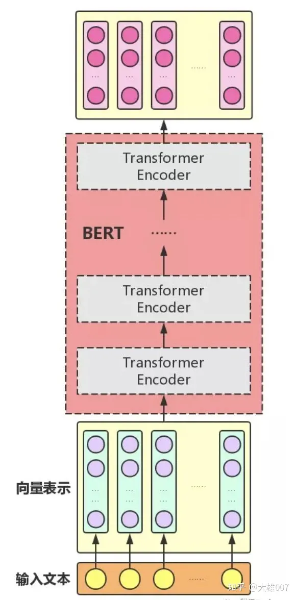

BERT的主要内容可以用下面的思维导图进行概括：

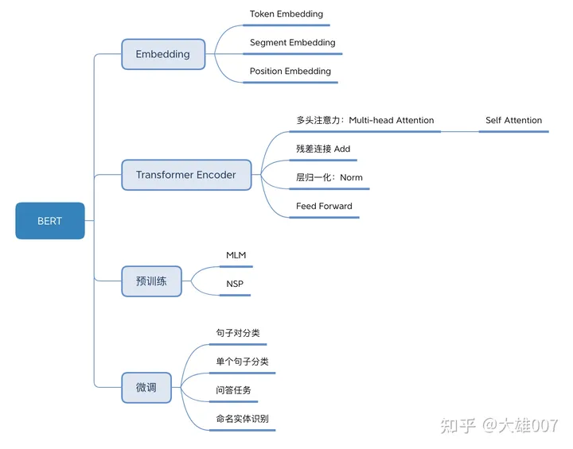

BERT是用了Transformer的encoder侧的网络，encoder中的Self-attention机制在编码一个token的时候同时利用了其上下文的token，其中‘同时利用上下文’即为双向的体现，而并非想Bi-LSTM那样把句子倒序输入一遍。在BERT之前是GPT，GPT使用的是Transformer的decoder侧的网络，GPT是一个单向语言模型的预训练过程，更适用于文本生成，通过前文去预测当前的字。

### 2.1Embedding

Embedding是由Embedding求和组成：

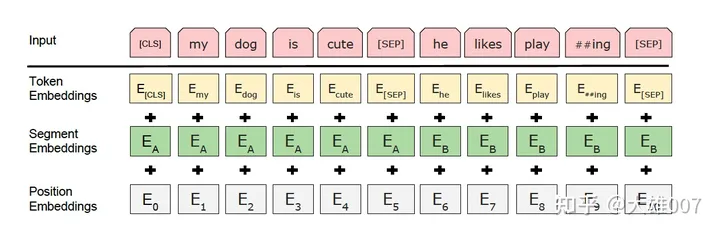

#### 2.1.1 Token Embeddings

Token Embeddings是词向量，第一个单词是CLS标志，可以用于之后的分类任务

通过建立字向量将每个字转换成一个一维向量，作为模型输入。Bert在处理英文文本时，只需要30522个词，Token Embedding层会将每个词转换成768维的向量

值得注意的是：在输入时，英文词汇会做更细粒度的切分，例如把playing切割成play和##ing，中文目前还未对输入文本进行分词。将词切割成更细粒度的Word Piece是为了解决未登录词的常见方法，即将出现频率较低词汇分割成出现频率高的词语。

举例：假如输入文本 ”I like dog“。下图则为 Token Embeddings 层实现过程。输入文本在送入 Token Embeddings 层之前要先进性 tokenization 处理，且两个特殊的 Token 会插入在文本开头 [CLS] 和结尾 [SEP]。[CLS]表示该特征用于分类模型，对非分类模型，该符号可以省去。[SEP]表示分句符号，用于断开输入语料中的两个句子。例子中 5 个Token 会被转换成一个 (6, 768) 的矩阵或 (1, 6, 768) 的张量。

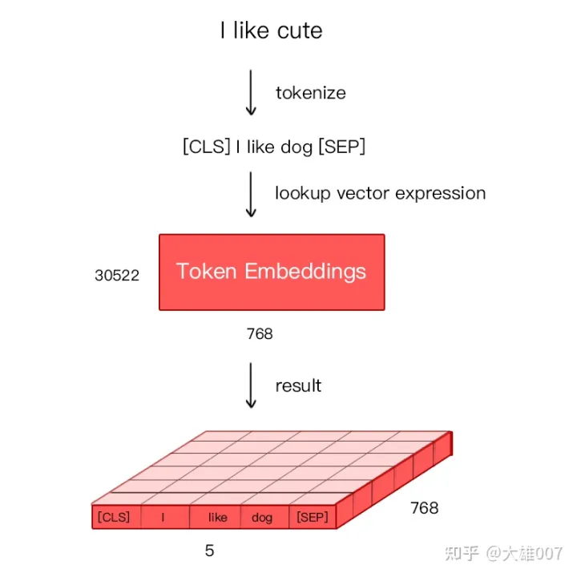

#### 2.1.2 Segment Embedding

Segment Embeddings用来区别两种句子，因为预训练不光做LM还要做以两个句子为输入的分类任务

Bert 能够处理句子对的分类任务，这类任务就是判断两个文本是否是语义相似的。句子对中的两个句子被简单的拼接在一起后送入模型中，Bert 如何区分一个句子对是两个句子呢？答案就是 Segment Embeddings。

Segement Embeddings 层有两种向量表示，前一个向量是把 0 赋值给第一个句子的各个 Token，后一个向量是把1赋值给第二个句子的各个 Token，问答系统等任务要预测下一句，因此输入是有关联的句子。而如果文本分类只有一个句子的话，那么 Segement embeddings 就全部是 0。

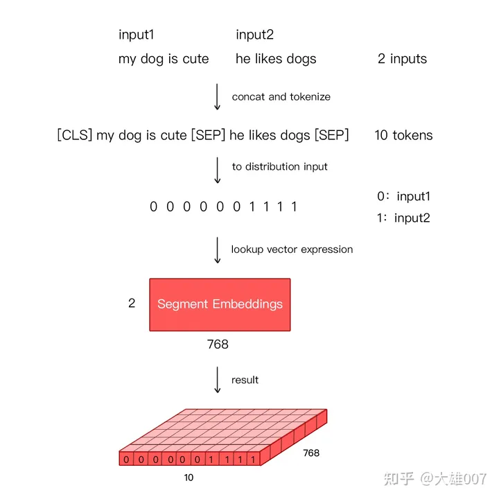

#### 2.1.3 Position Embedding

Position Embeddings和之前文章中的Transformer不一样，不是三角函数而是**学习**出来的

由于出现在文本不同位置的字/词所携带的语义信息存在差异(如 ”你爱我“ 和 ”我爱你“)，你和我虽然都和爱字很接近，但是位置不同，表示的含义不同。

在 RNN 中，第二个 ”I“ 和 第一个 ”I“ 表达的意义不一样，因为它们的隐状态不一样。对第二个 ”I“ 来说，隐状态经过 ”I think therefore“ 三个词，包含了前面三个词的信息，而第一个 ”I“ 只是一个初始值。因此，RNN 的隐状态保证在不同位置上相同的词有不同的输出向量表示。

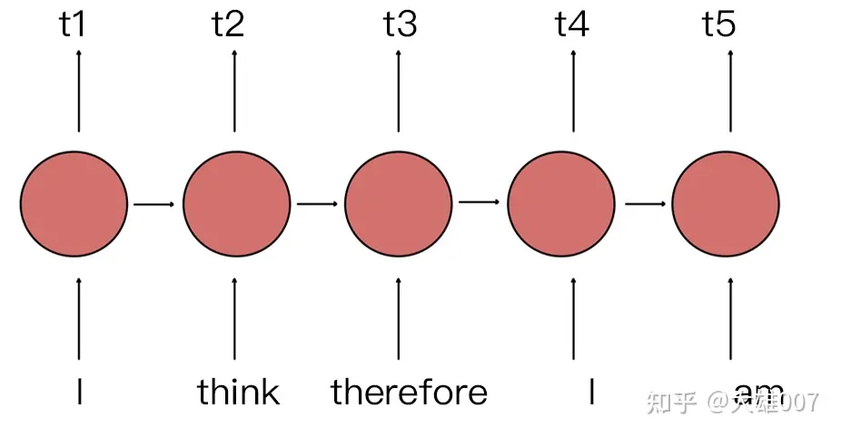

RNN 能够让模型隐式的编码序列的顺序信息，相比之下，Transformer 的自注意力层 (Self-Attention) 对不同位置出现相同词给出的是同样的输出向量表示。尽管 Transformer 中两个 ”I“ 在不同的位置上，但是表示的向量是相同的。

Transformer 中通过植入关于 Token 的相对位置或者绝对位置信息来表示序列的顺序信息。作者测试用**学习**的方法来得到 Position Embeddings，并且发现固定位置和相对位置效果差不多，所以最后用的是固定位置的，并且正弦可以处理更长的 Sequence，且可以用前面位置的值线性表示后面的位置。

BERT 中处理的最长序列是 512 个 Token，长度超过 512 会被截取，BERT 在各个位置上学习一个向量来表示序列顺序的信息编码进来，这意味着 Position Embeddings 实际上是一个 (512, 768) 的 lookup 表，表第一行是代表第一个序列的每个位置，第二行代表序列第二个位置。

最后，BERT 模型将 Token Embeddings (1, n, 768) + Segment Embeddings(1, n, 768) + Position Embeddings(1, n, 768) 求和的方式得到一个 Embedding(1, n, 768) 作为模型的输入。

#### 2.1.4 [CLS]的作用

无明显语义信息的符号

BERT在第一句前会加一个[CLS]标志，最后一层该位对应向量可以作为整句话的语义表示，从而用于下游的分类任务等。因为与文本中已有的其它词相比，这个无明显语义信息的符号会更“公平”地融合文本中各个词的语义信息，从而更好的表示整句话的语义。 

具体来说，self-attention是用文本中的其它词来增强目标词的语义表示，但是目标词本身的语义还是会占主要部分的，因此，经过BERT的12层（BERT-base为例），每次词的embedding融合了所有词的信息，可以去更好的表示自己的语义。而[CLS]位本身没有语义，经过12层，句子级别的向量，相比其他正常词，可以更好的表征句子语义。

### 2.2Transformer Encoder

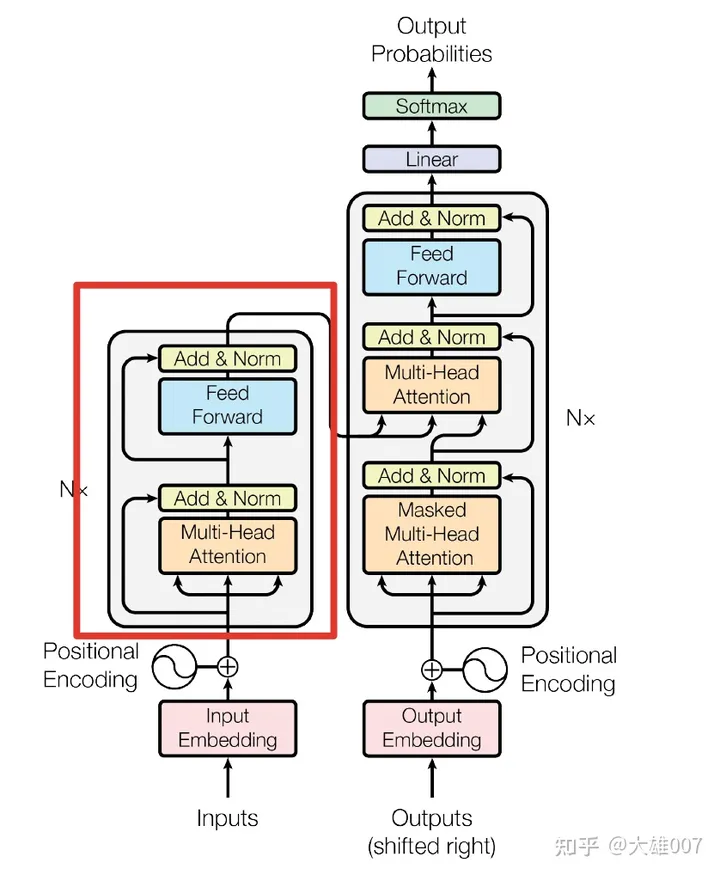

BERT是用了Transformer的encoder侧的网络，如上图的transformer的Encoder部分，关于transformer的encoder的详细介绍可以参考链接：https://paddlepedia.readthedocs.io/en/latest/index.html

在Transformer中，模型的输入会被转换成512维的向量，然后分为8个head，每个head的维度是64维，但是BERT的维度是768维度，然后分成12个head，每个head的维度是64维，这是一个微小的差别。Transformer中position Embedding是用的三角函数，BERT中也有一个Postion Embedding是随机初始化，然后从数据中学出来的。

BERT模型分为24层和12层两种，其差别就是使用transformer encoder的层数的差异，BERT-base使用的是12层的Transformer Encoder结构，BERT-Large使用的是24层的Transformer Encoder结构。

### 2.3BERT的可视化

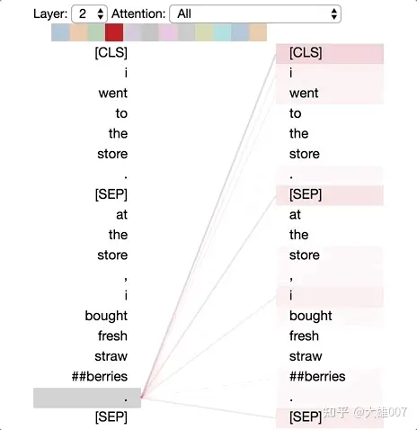

如上图将注意力看做不同的连线，它们用来连接被更新的位置（左半边）与被注意的位置（右半边）。不同的颜色分别代表相应的注意头，而线条颜色的深浅代表被注意的强度。

#### 2.3.1 注意力的六种模式

这里采用以下例句：

句子A：I went to the store.句子B：At the store, I bought fresh strawberries.

BERT 用 WordPiece工具来进行分词，并插入特殊的分离符（[CLS]，用来分隔样本）和分隔符（[SEP]，用来分隔样本内的不同句子）。因此实际输入序列为： [CLS] i went to the store . [SEP] at the store , i bought fresh straw ##berries . [SEP]

##### 模式1：注意下一个词

在这种模式中，每个位置主要注意序列中的下一个词（token）。下面将看到第2层0号头的一个例子。（所选头部由顶部颜色条中突出的显示色块表示。）

左：所有词的注意力。 右：所选词的注意力权重（“i”）

左边显示了所有词的注意力，而右侧图显示一个特定词（“i”）的注意力。在这个例子中，“i”几乎所有的注意力都集中在“went”上，即序列中的下一个词。

在左侧，可以看到 [SEP]符号不符合这种注意力模式，因为[SEP]的大多数注意力被引导到了[CLS]上，而不是下一个词。因此，这种模式似乎主要在每个句子内部出现。

该模式与后向RNN 有关，其状态的更新是从右向左依次进行。模式1出现在模型的多个层中，在某种意义上模拟了RNN 的循环更新。

##### 模式2：注意前一个词

在这种模式中，大部分注意力都集中在句子的前一个词上。例如，下图中“went”的大部分注意力都指向前一个词“i”。

这个模式不像上一个那样显著。有一些注意力也分散到其他词上了，特别是[SEP]符号。与模式1一样，这与RNN 有些类似，只是这种情况下更像前向RNN。

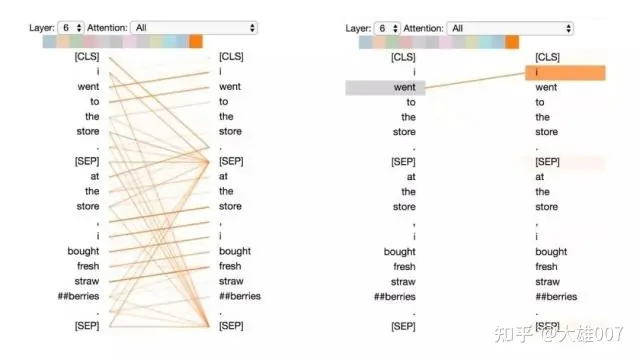

左：所有词的注意力。 右：所选词的注意力权重（“went”）

##### 模式3：注意相同或相关的单词

这种模式注意相同或相关的单词，包括其本身。在下面的例子中，第一次出现的“store”的大部分注意力都是针对自身和第二次出现的“store”。这种模式并不像其他一些模式那样显著，注意力会分散在许多不同的词上。

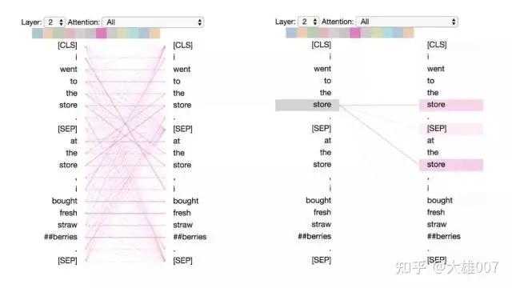

左：所有词的注意力。 右：所选词的注意权重（“store”）

##### 模式4：注意“其他”句子中相同或相关词

这种模式注意另一个句子中相同或相关的单词。例如，第二句中“store”的大部分注意力都指向第一句中的“store”。可以想象这对于下句预测任务（BERT预训练任务的一部分）特别有用，因为它有助于识别句子之间的关系。

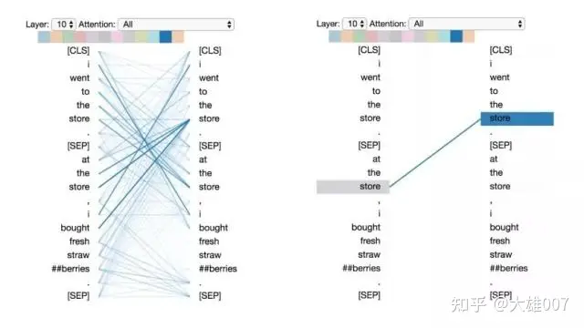

左：所有词的注意力。 右：所选词的注意权重（“store”）

##### 模式5：注意能预测该词的其他单词

这种模式似乎是更注意能预测该词的词，而不包括该词本身。在下面的例子中，“straw”的大部分注意力都集中在“##berries”上（strawberries 草莓，因为WordPiece分开了），而“##berries”的大部分注意力也都集中在“straw”上。

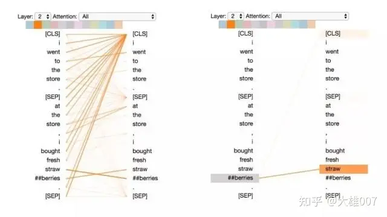

左：所有词的注意力。 右：所选词的注意力（“## berries”）

##### 模式6：注意分隔符

在这种模式中，词语的大部分注意力都集中在分隔符[CLS]或 [SEP]上。在下面的示例中，大部分注意力都集中在两个 [SEP]符号上。这可能是模型将句子级状态传播到单个词语上的一种方式。

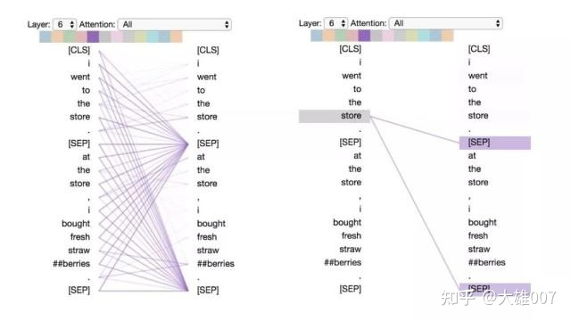

左：所有词的注意力。 右：所选词的注意权重（“store”）

## 3：BERT的训练

BERT的训练包含pre-train和fine-tune两个阶段。pre-train阶段模型是在无标注的标签数据上进行训练，fine-tune阶段，BERT模型首先是被pre-train模型参数初始化，然后所有的参数会用下游的有标注的数据进行训练。

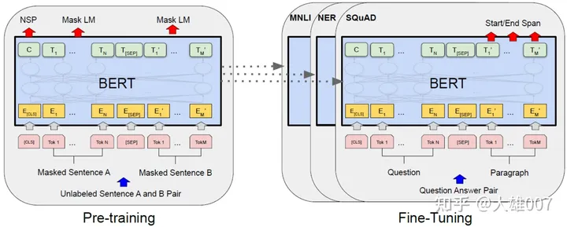

#### 3.1BERT的预训练

BERT是一个多任务模型，它的预训练（Pre-training）任务是由两个自监督任务组成，即MLM和NSP，如图所示。

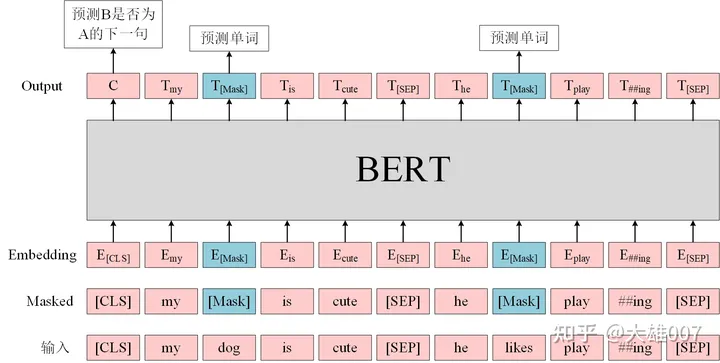

##### 3.1.1MLM

MLM是指在训练的时候随即从输入语料上mask掉一些单词，然后通过的上下文预测该单词，该任务非常像我们在中学时期经常做的完形填空。正如传统的语言模型算法和RNN匹配那样，MLM的这个性质和Transformer的结构是非常匹配的。在BERT的实验中，15%的WordPiece Token会被随机Mask掉。在训练模型时，一个句子会被多次喂到模型中用于参数学习，但是Google并没有在每次都mask掉这些单词，而是在确定要Mask掉的单词之后，做以下处理。

1. 80%的时候会直接替换为[Mask]，将句子 "my dog is cute" 转换为句子 "my dog is [Mask]"。
2. 10%的时候将其替换为其它任意单词，将单词 "cute" 替换成另一个随机词，例如 "apple"。将句子 "my dog is cute" 转换为句子 "my dog is apple"。
3. 10%的时候会保留原始Token，例如保持句子为 "my dog is cute" 不变。

这么做的原因是如果句子中的某个Token 100%都会被mask掉，那么在fine-tuning的时候模型就会有一些没有见过的单词。加入随机Token的原因是因为Transformer要保持对每个输入token的分布式表征，否则模型就会记住这个[mask]是token ’cute‘。至于单词带来的负面影响，因为一个单词被随机替换掉的概率只有15%*10% =1.5%，这个负面影响其实是可以忽略不计的。 另外文章指出每次只预测15%的单词，因此模型收敛的比较慢。

优点：

1）被随机选择15%的词当中以10%的概率用任意词替换去预测正确的词，相当于文本纠错任务，为BERT模型赋予了一定的文本纠错能力；

2）被随机选择15%的词当中以10%的概率保持不变，缓解了finetune时候与预训练时候输入不匹配的问题（预训练时候输入句子当中有mask，而finetune时候输入是完整无缺的句子，即为输入不匹配问题）。

##### 3.1.2NSP

Next Sentence Prediction（NSP）的任务是判断句子B是否是句子A的下文。如果是的话输出’IsNext‘，否则输出’NotNext‘。训练数据的生成方式是从平行语料中随机抽取的连续两句话，其中50%保留抽取的两句话，它们符合IsNext关系，另外50%的第二句话是随机从预料中提取的，它们的关系是NotNext的。这个关系保存在图4中的[CLS]符号中。

**输入 = [CLS] 我 喜欢 玩 [Mask] 联盟 [SEP] 我 最 擅长 的 [Mask] 是 亚索 [SEP]**

类别 = IsNext

**输入 = [CLS] 我 喜欢 玩 [Mask] 联盟 [SEP] 今天 天气 很 [Mask] [SEP]**

类别 = NotNext

BERT预训练模型最多只能输入512个词，这是因为在BERT中，Token，Position，Segment Embeddings 都是通过学习来得到的。在直接使用Google 的BERT预训练模型时，输入最多512个词（还要除掉[CLS]和[SEP]），最多两个句子合成一句。这之外的词和句子会没有对应的embedding。

#### 3.2BERT的微调

在海量的语料上训练完BERT之后，便可以将其应用到NLP的各个任务中了。 微调(Fine-Tuning)的任务包括：**基于句子对的分类任务**，**基于单个句子的分类任务**，**问答任务**，**命名实体识别等**。

- 基于句子对的分类任务：

- - MNLI：给定一个前提 (Premise) ，根据这个前提去推断假设 (Hypothesis) 与前提的关系。该任务的关系分为三种，蕴含关系 (Entailment)、矛盾关系 (Contradiction) 以及中立关系 (Neutral)。所以这个问题本质上是一个分类问题，我们需要做的是去发掘前提和假设这两个句子对之间的交互信息。

  - - QQP：基于Quora，判断 Quora 上的两个问题句是否表示的是一样的意思。
    - QNLI：用于判断文本是否包含问题的答案，类似于我们做阅读理解定位问题所在的段落。
    - STS-B：预测两个句子的相似性，包括5个级别。
    - MRPC：也是判断两个句子是否是等价的。
    - RTE：类似于MNLI，但是只是对蕴含关系的二分类判断，而且数据集更小。
    - SWAG：从四个句子中选择为可能为前句下文的那个。

- 基于单个句子的分类任务

- - SST-2：电影评价的情感分析。

  - - CoLA：句子语义判断，是否是可接受的（Acceptable）。

- **问答任务**

- - **SQuAD v1.1：给定一个句子（通常是一个问题）和一段描述文本，输出这个问题的答案，类似于做阅读理解的简答题。**

- 命名实体识别

- - CoNLL-2003 NER：判断一个句子中的单词是不是Person，Organization，Location，Miscellaneous或者other（无命名实体）。

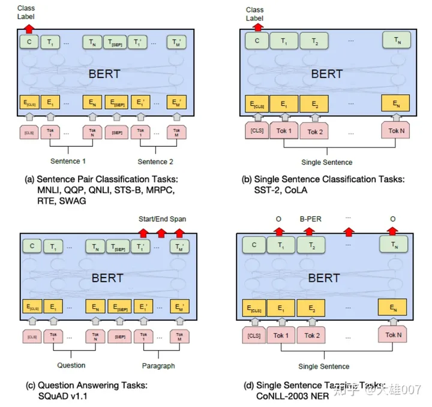

## 4：BERT,GPT,ELMO的区别

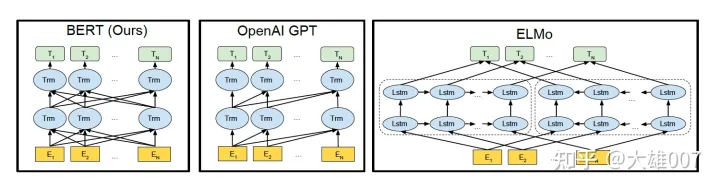

如上图所示，图中的Trm代表的是Transformer层，E代表的是Token Embedding，即每一个输入的单词映射成的向量，T代表的是模型输出的每个Token的特征向量表示。

BERT使用的是双向的Transformer，OpenAI GPT使用的是从左到右的Transformer。ELMo使用的是单独的从左到右和从右到左的LSTM拼接而成的特征。其中只有BERT在所有的层考虑了左右上下文。除此之外，BERT和OpenAI GPT是微调（fine-tuning）的方法，而ELMo是一个基于特征的方法。

### BERT 比 ELMo 效果好的原因

从网络结构以及最后的实验效果来看，BERT 比 ELMo 效果好主要集中在以下几点原因：

1. LSTM 抽取特征的能力远弱于 Transformer
2. 拼接方式双向融合的特征融合能力偏弱
3. BERT 的训练数据以及模型参数均多于 ELMo

## 5：BERT的优缺点

### **5.1优点**

- BERT 相较于原来的 RNN、LSTM 可以做到并发执行，同时提取词在句子中的关系特征，并且能在多个不同层次提取关系特征，进而更全面反映句子语义。
- 相较于 word2vec，其又能根据句子上下文获取词义，从而避免歧义出现。

### **5.2缺点**

- 模型参数太多，而且模型太大，少量数据训练时，容易过拟合。
- BERT的NSP任务效果不明显，MLM存在和下游任务mismathch的情况。
- BERT对生成式任务和长序列建模支持不好。
