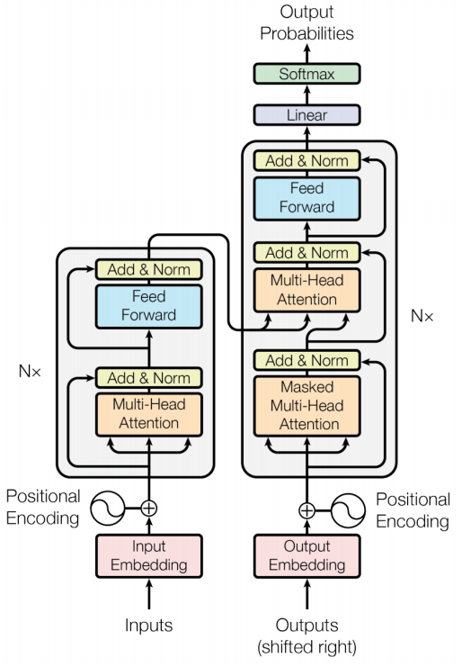

# Transformer

## 1.介绍

Transformer 网络架构架构种编码器和解码器没有采用 RNN 或 CNN 等网络架构，而是采用完全依赖于注意力机制的架构。

Transformer改进了RNN被人诟病的训练慢的特点，利用self-attention可以实现快速并行。

## 2.直观认识

Transformer主要由encoder和decoder两个部分组成。
encoder和decoder均由6个encoder layer和decoder layer组成，称之为encoder block

每一个encoder和decoder内部简版结构如下：

encoder：包含两层，一个self-attention层和一个前馈神经网络，self-attention能帮助当前节点不仅仅只关注当前的词，从而可以获得上下文的语义。

decoder：除了encoder中提到的两层之外，还有两层中间一层attention层，帮助当前节点获取到当前需要关注的重点内容。

大致处理流程：
首先，模型需要对数日的数据进行一个embedding操作。
其次，embedding结束后，输入到encoder层。
然后，self-attention处理完数据后把数据送到前馈神经网络。
最后，前馈神经网络的计算可以并行，得到的输出会输入到下一个encoder。

## 3.Transformer的结构

Transformer的结构解析出来如下图表示，包括Input Embedding, Position Embedding, Encoder, Decoder。

### 3.1Embedding

字向量与位置编码的公式表示如下：X=EmbeddingLookup(X)+PositionEncoding

#### 3.1.1Input Embedding

可以将Input Embedding看作是一个 lookup table，对于每个 word，进行 word embedding 就相当于一个lookup操作，查出一个对应结果。从词向量表里找出每个词对应的向量表示。

假设输入为句子的话，Xt就代表第t个词。（x1,x2,x3.......xn）-->(z1,z2,z3......zn)长度为n的向量表示，每个Zt对应的是Xt的向量表示。

#### 3.1.2Position Encoding

Transformer模型种还缺少一种解释输入序列中单词顺序的方法。为了处理这个问题，transformer给encoder层和decoder层的输入添加了一个额外的向量Positional Encoding，维度和embedding的维度一样，这个向量采用了一种独特的方法来学习这个值，这个向量能决定当前词的位置，或者说一个句子中不同的词之间的距离。论文中的计算方法（利用三角函数，bert是通过学习得到位置向量）如下：

其中，pos是指当前词在句子中的位置，i是指向量中每个值的index，可以看出，在偶数位置，使用正弦编码，在奇数位置，使用余弦编码。

### 3.2Encoder

一个Transformer Encoder block的计算过程：

#### 3.2.1自注意力机制

- 首先，自注意力机制（self-attention）会计算出三个新的向量，在论文中，向量的维度是512维，我们把这三个向量分别称为Query、Key、Value，这三个向量是用embedding向量与一个矩阵相乘得到的结果，这个矩阵是随机初始化的，维度为（512，512）注意第二个维度需要和embedding的维度一样，其值在反向传播的过程中会一直进行更新，得到的这三个向量的维度是64低于embedding维度的。

  

- 计算self-attention的分数值，该分数值决定了当我们在某个位置encode一个词时，对输入句子的其他部分的关注程度。这个分数值的计算方法是Query与Key做点乘，以下图为例，首先我们需要针对Thinking这个词，计算出其他词对于该词的一个分数值，首先是针对于自己本身即q1·k1，然后是针对于第二个词即q1·k2

- 接下来，把点乘的结果除以一个常数，这里我们除以8，这个值一般是采用上文提到的矩阵的第一个维度的开方即64的开方8，当然也可以选择其他的值，然后把得到的结果做一个softmax的计算。得到的结果即是每个词对于当前位置的词的相关性大小，当然，当前位置的词相关性肯定会会很大

  

- 下一步就是把Value和softmax得到的值进行相乘，并相加，得到的结果即是self-attetion在当前节点的值。

在实际的应用场景，为了提高计算速度，我们采用的是矩阵的方式，直接计算出Query, Key, Value的矩阵，然后把embedding的值与三个矩阵直接相乘，把得到的新矩阵Q与K相乘，乘以一个常数，做softmax操作，最后乘上V矩阵：

这种通过 query 和 key 的相似性程度来确定 value 的权重分布的方法被称为scaled dot-product attention。

用公式表达如下：

#### 3.2.2Self-Attention复杂度

Self-Attention时间复杂度：O(n2⋅d)O(n2⋅d) ，这里，n是序列的长度，d是embedding的维度。

Self-Attention包括三个步骤：相似度计算，softmax和加权平均，它们分别的时间复杂度是：

相似度计算可以看作大小为(n,d)和(d,n)的两个矩阵相乘： (n,d)∗(d,n)=(n2⋅d)(n,d)∗(d,n)=(n2⋅d)，得到一个(n,n)的矩阵

softmax就是直接计算了，时间复杂度为: O(n2)O(n2)

加权平均可以看作大小为(n,n)和(n,d)的两个矩阵相乘： (n,d)∗(d,n)=(n2⋅d)(n,d)∗(d,n)=(n2⋅d)，得到一个(n,d)的矩阵

因此，Self-Attention的时间复杂度是: O(n2⋅d)

#### 3.2.3Multi-head Attention

为了模拟卷积神经网络多通道输出的效果。

不仅仅只初始化一组Q,K,V的矩阵，而是初始化多组，transformer是使用了8组，所以最后得到的结果是八个矩阵。

multi-head注意力的全过程如下，首先输入句子，“Thinking Machines”,在embedding模块把句子中的每个单词变成向量X，在encoder层（一共有6个encoder层）中，除了第0层有embedding操作外，其他的层没有embedding操作；接着把X分成8个head（应该是复制八个x）

最后得到的各个zi需要拼接起来（行数不变，列数等于原来的八倍），然后乘权重矩阵W0，得到最后的z

注意：维度问题：

X：（n,512）n是句子序列长度，这里应该是词的数量。八个X
WQ，WK，WV：（8,512,64）
Wo：（512,512）
Zi：（8,n,64）
Qi，Ki，Vi：（8,n,64）
Z：（n,512）

#### 3.2.5残差连接（add）

经过 self-attention 加权之后输出，也就是Attention(Q,K,V) ，然后把他们加起来做残差连接

除了self-attention这里做残差连接外，feed forward那个地方也需要残差连接，公式类似：

#### 3.2.6Layer Normalization

Layer Normalization 的作用是把神经网络中隐藏层归一为标准正态分布，也就是独立同分布，以起到加快训练速度，加速收敛的作用 ：

#### 3.2.7Feed Forward

将Multi-Head Attention得到的向量再投影到一个更大的空间（论文里将空间放大了4倍）在那个大空间里可以更方便地提取需要的信息（使用Relu激活函数），最后再投影回token向量原来的空间

### 3.3Decoder

和 Encoder 一样，上面三个部分的每一个部分，都有一个残差连接，后接一个 Layer Normalization。

下面会介绍Decoder的Masked Self-Attention和Encoder-Decoder Attention两部分，其结构图如下图所示

#### 3.3.1Masked Self-Attention

传统 Seq2Seq 中 Decoder 使用的是 RNN 模型，因此在训练过程中输入t时刻的词，模型无论如何也看不到未来时刻的词，因为循环神经网络是时间驱动的，只有当t时刻运算结束了，才能看到t+1时刻的词。而 Transformer Decoder 抛弃了 RNN，改为 Self-Attention，由此就产生了一个问题，在训练过程中，整个 ground truth 都暴露在 Decoder 中，这显然是不对的，我们需要对 Decoder 的输入进行一些处理，该处理被称为 Mask。

在解码器中的自注意力层允许解码器中的每个位置关注到该位置及其之前的所有位置。为了保持自回归属性，我们需要阻止解码器中的左向信息流动。我们通过在缩放的点积注意力机制内进行实现，对于与非法连接相对应的输入值，在softmax函数的输入中进行屏蔽（设为-∞）。

Mask 非常简单，首先生成一个下三角全 0，上三角全为负无穷的矩阵，然后将其与 Scaled Scores 相加即可，之后再做 softmax，就能将 -inf 变为 0，得到的这个矩阵即为每个字之间的权重。

**总的来说就是，不希望decoder运用当前位置词与之前词的相关性信息，因此把Scaled Scores矩阵上三角全部变为负无穷。就是隐藏了当前词与之前词的相关性信息。**

#### 3.3.2Multi Endecoder-Decoder Attention

 其实这一部分的计算流程和前面 Masked Self-Attention 很相似，结构也一摸一样，唯一不同的是这里的K,V为 Encoder 的输出，Q为 Decoder 中 Masked Self-Attention 的输出

#### 3.3.3Decoder的解码过程

### 3.4Transformer的最后一层和Softmax

线性层是一个简单的全连接的神经网络，它将解码器堆栈生成的向量投影到一个更大的向量，称为logits向量。如图linear的输出

softmax层将这些分数转换为概率（全部为正值，总和为1.0）。选择概率最高的单元，并生成与其关联的单词作为此时间步的输出。如图softmax的输出。

### 3.5了解：Transformer的权重共享

Transformer在两个地方进行了权重共享：

- （1）Encoder和Decoder间的Embedding层权重共享；

《Attention is all you need》中Transformer被应用在机器翻译任务中，源语言和目标语言是不一样的，但它们可以共用一张大词表，对于两种语言中共同出现的词（比如：数字，标点等等）可以得到更好的表示，而且对于Encoder和Decoder，嵌入时都只有对应语言的embedding会被激活，因此是可以共用一张词表做权重共享的。

论文中，Transformer词表用了bpe来处理，所以最小的单元是subword。英语和德语同属日耳曼语族，有很多相同的subword，可以共享类似的语义。而像中英这样相差较大的语系，语义共享作用可能不会很大。

但是，共用词表会使得词表数量增大，增加softmax的计算时间，因此实际使用中是否共享可能要根据情况权衡。

- （2）Decoder中Embedding层和FC层权重共享；

Embedding层可以说是通过onehot去取到对应的embedding向量，FC层可以说是相反的，通过向量（定义为 x）去得到它可能是某个词的softmax概率，取概率最大（贪婪情况下）的作为预测值。

那哪一个会是概率最大的呢？在FC层的每一行量级相同的前提下，理论上和 x 相同的那一行对应的点积和softmax概率会是最大的（可类比本文问题1）。

因此，Embedding层和FC层权重共享，Embedding层中和向量 x 最接近的那一行对应的词，会获得更大的预测概率。实际上，Decoder中的Embedding层和FC层有点像互为逆过程。

通过这样的权重共享可以减少参数的数量，加快收敛。

## 4.总结

本文详细介绍了Transformer的细节，包括Encoder，Decoder部分，输出解码的部分，Transformer的共享机制等等。
