# 图卷积神经网络

​	图的结构一般来说是十分不规则的，可以认为是无限维的一种数据，所以它没有平移不变性。每一个节点的周围结构可能都是独一无二的，这种结构的数据，就让传统的CNN、RNN瞬间失效。而图数据却很少有相应的模型供我们直接使用，所以GCN应运而生。

## GCN是做什么的

GCN图卷积神经网络，实际上跟卷积神经网络CNN的作用一样，就是一个特征提取器，只不过它的对象是**图数据**。

GCN精妙地设计了一种从图数据中提取特征的方法，从而让我们可以使用这些特征去对图数据进行节点分类（node classification）、图分类（graph classification）、边预测（link prediction），还可以顺便得到图的嵌入表示（graph embedding），可见用途广泛。

这里的**图数据**指的不是图片，而是这种具有图结构的数据：

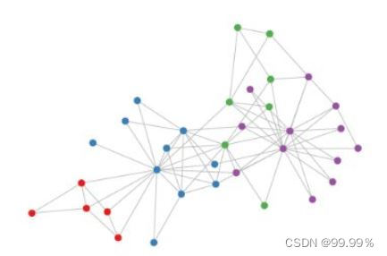

就像"卷积"这个名字所指代的那样，这个想法来自于图像，之后引进到图（Graphs）中。于有固定的结构的图像相比时，图（Graphs）就复杂得多。

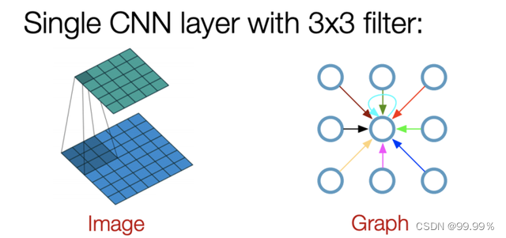

## GCN算法

假设有一批图数据，其中有N个节点（node），每个节点都有自己的特征，假设特征一共有D个，我们设这些节点的特征组成一个N×D维的矩阵X，然后各个节点之间的关系也会形成一个N×N维的矩阵A，也称为邻接矩阵（adjacency matrix）。X和A便是我们模型的输入。

**GCN算法的步骤简单可总结为：**

第一步聚类
第二步更新
第三步循环

### 聚类

对于每个节点，我们在聚类时从它的所有邻居节点处获取其特征信息，当然也包括它自身的特征。

**举个例子**

我们想通过聚类，估计出一个人的工资水平

因为有一句很有名的鸡汤 『你朋友圈的平均工资就是你的工资』

先假设：一个人所有朋友的工资平均值等于那个人的工资，利用社交网络（graph图）中的关联信息（edge边），我们可以得到节点的有效信息

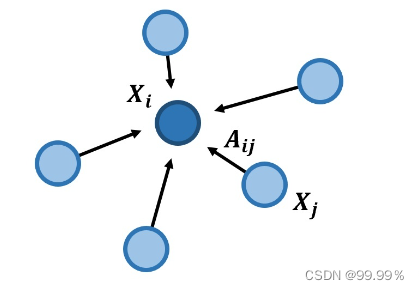

当前节点可以用相邻节点推断出来。我们先考虑用相邻节点的加和来代表当前节点：

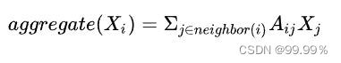

如果图中的边没有权重，Xj是每个节点的特征值， Aij也就是节点间的关系只能为0或1。当一个节点不是i的邻居节点时，Aij就是0。

那么我们将Aij写成描述节点间关系的邻接矩阵A，就能得到：

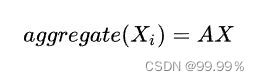

但是没有权重显然不合适，因为假如我和马云见过一面，相互仅是认识，但是马化腾和马云是铁哥们，那么将我与马云间联系的权重和马化腾与马云间联系的权重都设为1就是不合理的，所以在处理问题时，Aij一定可以为0到1的任意值，这样才可以科学的计算我的工资水平。

并且只考虑朋友的工资水平也是不科学的，比如有的人会拍领导马屁，那么他的工资就会比没有拍马屁技能的同事高。

所以要想准确评估他的工资，还要加上他自身的一些特征Xi。在矩阵里就是加上自连接矩阵I：

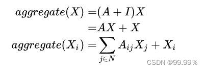

截止目前，我们已经结合节点特征，将朋友们的工资科学地进行了求和，那么接下来就需要取平均值了

因为可能某些技术高薪大佬，朋友不多但是个个有钱，而某些人善于交际，狐朋狗友就很多，虽然狐朋狗友的工资低，但是也架不住多。

所以需要求平均，求平均的公式：（这公式可能不对，理解什么意思就行了）

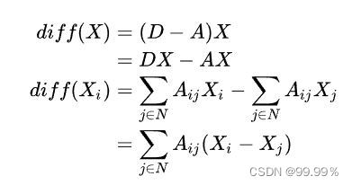

分母是节点个数，分子就是节点特征，然后进行求和。

到目前为止，我们就通过求平均，得到了一个人的工资水平，当然简单的求平均肯定是不完善的；

假如我的朋友只有一个大佬，那么我和大佬的关系网络如果用平均算法的话就等同了，所以直接把B的特征赋给A肯定是不合适的

而GCN中的传播公式就可以解决这个问题：（后续解释这个公式什么意思）

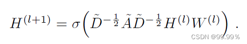

## GCN的结构

GCN是一个多层的图卷积神经网络，**每一个卷积层仅处理一阶邻域信息，通过叠加若干卷积层可以实现多阶邻域的信息传递**。（每次卷积都求一阶相邻的节点的信息，然后下次卷积再求一阶相邻节点信息中就包含二阶的节点信息了）

从输入层开始，前向传播经过图卷积层运算，然后经过softmax激活函数的运算得到预测分类概率分布。

softmax的作用是将卷积网络的输出的结果进行概率化，我直接将Softmax理解为依据公式运算出样本点的类别。

假设我们构造一个两层的GCN，激活函数分别采用ReLU和Softmax，则整体的正向传播的公式为：

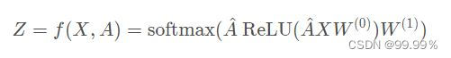

**该模型实际是输入层+隐藏层（图卷积层，类似全连接层的作用）+SoftMax+输出层构成的，GCN模型可视化为：**

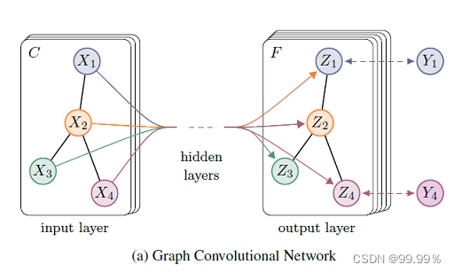

GCN输入一个图，通过若干层GCN每个node的特征从X变成了Z，但是，无论中间有多少层，node之间的连接关系，即邻接矩阵A，都是共享的。 

## GCN的传播公式

GCN就是一个神经网络层，每一层GCN的输入都是邻接矩阵A和node的特征H，它的层与层之间的**传播方式**是：

下图中的特征矩阵x相当于公式中的H（最初的特征矩阵是给定的数据或通过tf-idf等方法转向量得到的）：

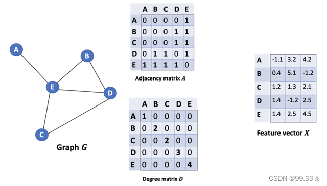

这个公式中：

A波浪=A+I，I是单位矩阵，相当于是无向图G的邻接矩阵加上自连接(就是每个顶点和自身加一条边)

如此一来消息聚合时不仅能聚合来自其他结点的消息，还能聚合结点自身的消息。

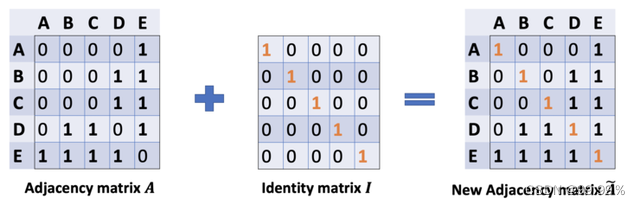

D波浪是A波浪的度矩阵（degree matrix），公式为D波浪ii=∑j A波浪（无向图里,节点的度就是节点连接的边的个数。）

H是每一层的特征，对于输入层的话，H就是X（初始就给定的）

σ是像Softmax、ReLU这样的非线性激活函数

W就是每一层模型的参数，也就是模型给节点特征乘上的权重，这是模型需要训练的参数，即权值矩阵

他们之间的运算，就是各矩阵相乘，部分内容就长这样：

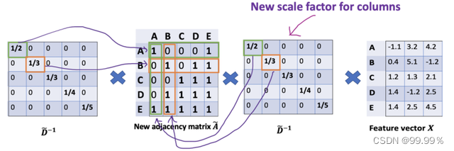

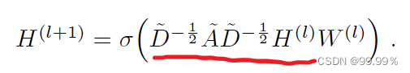

其实我们需要重点关注的就是上面画红线的部分，也就是对称归一化的拉普拉斯矩阵，拉普拉斯矩阵是对称矩阵，可以进行特征分解（谱分解）

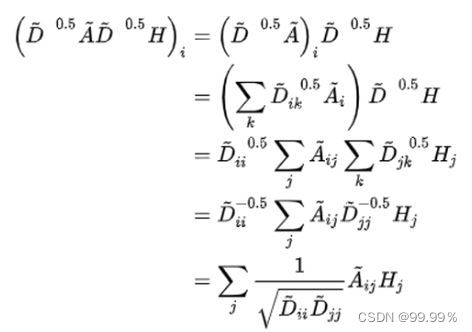

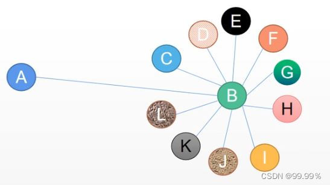

回到最开始的问题，这个公式会考虑到B节点的度，那么A就不会分到B很多的特征，因为A对B来说只是万千朋友的一个，分母就变大了。

## 总结

**GCN就是在平均法的基础上，加入了针对每个节点度的归一化。**

GCN的每一层通过邻接矩阵A和特征矩阵H(l)相乘得到每个顶点邻居特征的汇总，然后再乘上一个参数矩阵W(l),加上激活函数σ做一次非线性变换得到聚合邻接顶点特征的矩阵H(l+1)。

之所以邻接矩阵A要加上一个单位矩阵I，是因为我们希望在进行信息传播的时候顶点自身的特征信息也得到保留。

而对邻居矩阵A波浪进行归一化操作D^(-1/2)A*D是为了信息传递的过程中保持特征矩阵H的原有分布，防止一些度数高的顶点和度数低的顶点在特征分布上产生较大的差异。
