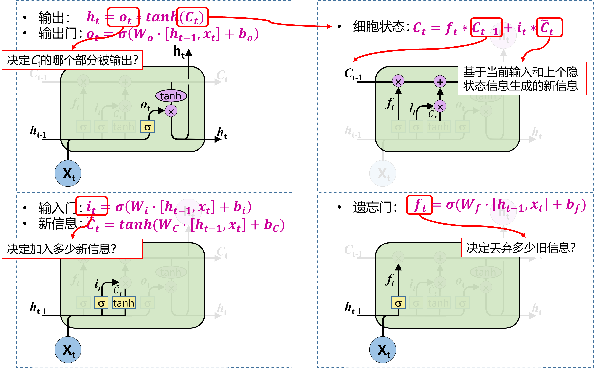
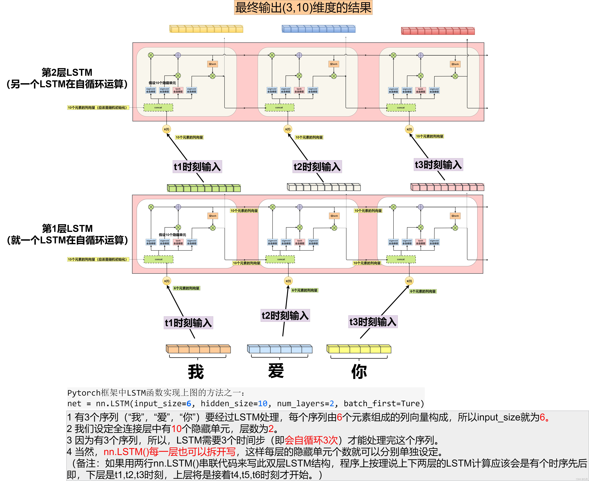
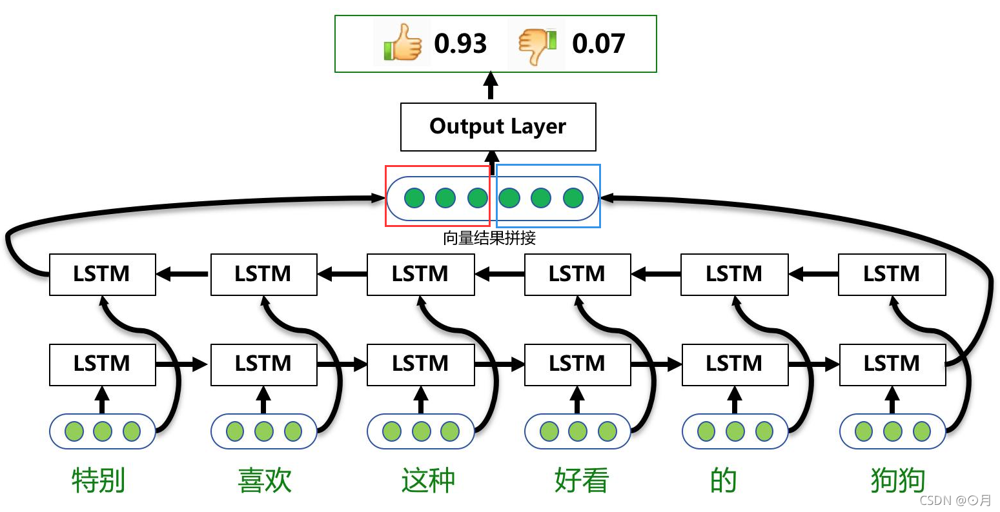
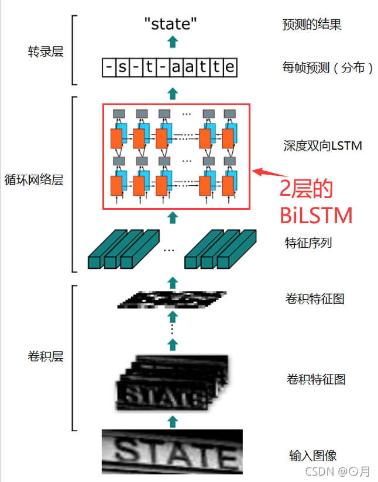

# LSTM（长短时记忆神经网络）

长短时记忆神经网络（Long Short-Term Memory Neural Network，LSTM）是循环神经网络的一个变体，可以有效地解决长期依赖问题/梯度消失问题。

细胞的状态在整条链上运行，只有一些小的线性操作作用其上，信息很容易保持不变的流过整条链。

**门**(Gate)是一种可选地让信息通过的方式，由一个Sigmoid神经网络层和一个点乘法运算组成。Sigmoid神经网络层输出0和1之间的数字，这个数字描述每个组件有多少信息可以通过， 0表示不通过任何信息，1表示全部通过

- **遗忘门**决定我们要从细胞状态中丢弃什么信息。它查看ht-1(前一个隐藏状态)和xt(当前输入)，并为状态Ct-1(上一个状态)中的每个数字输出0和1之间的数字，1代表完全保留，而0代表彻底删除
- **输入门**决定要在细胞状态中存储什么信息。首先，输入门的Sigmoid层决定了我们将更新哪些值。然后，一个tanh层创建候选向量C ̃_t,该向量将会被加到细胞的状态中。最后，结合这两个向量来创建更新值。
- **更新记忆**：将上一个状态值Ct−1乘以f_t，以此表达期待忘记的部分。之后将得到的值加上 i_t∗C ̃_t。这个得到的是新的状态值
- **输出门**决定我们要输出什么， 此输出将基于当前的细胞状态。首先，通过一个sigmoid层，决定了我们要输出细胞状态的哪些部分。然后，将细胞状态通过tanh（将值规范化到-1和1之间），并将其乘以Sigmoid门的输出，至此完成了输出门决定的那些部分信息的输出。

# BiLSTM（双向长短期记忆神经网络）

首先看2层的 LSTM 是如何运转的

再看1层的 BiLSTM 是如何运转的

用一个文本情感分析的例子来说明：单层的BiLSTM其实就是2个LSTM，一个正向去处理序列，一个反向去处理序列，处理完后，**两个LSTM的输出会拼接起来**。

特别注意：在这个案例中，所有时间步计算完后，才算是BiLSTM的结果，正向LSTM经过6个时间步得到一个结果向量，反向LSTM同样经过6个时间步后，得到另一个结果，然后这两个结果向量拼接起来，作为BiLSTM的最终输出。

> 疑问：是不是NLP里面大多时候只需要最后一个时刻的输出即可？
>
> 答案：这属于N VS 1结构，即N次输入，1次输出。这种结构通常用来处理序列分类问题。如输入一段文字判别它所属的类别，输入一个句子判断其情感倾向，输入一段视频并判断它的类别等等。

再看看2层的 BiLSTM 是如何运转的

其实与两层的LSTM相差不大，区别是每层多了一个反向序列的LSTM
