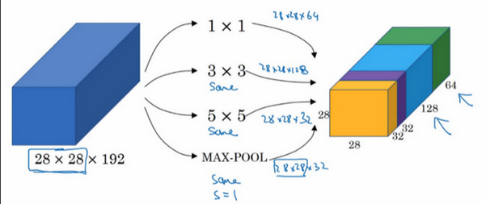
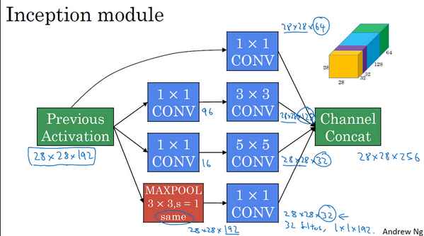
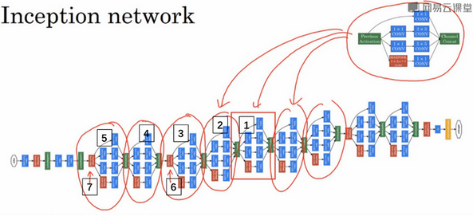
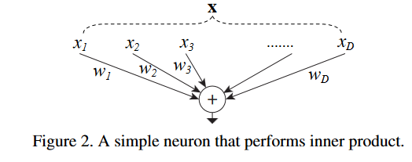
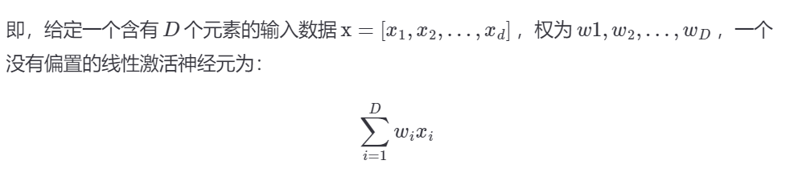
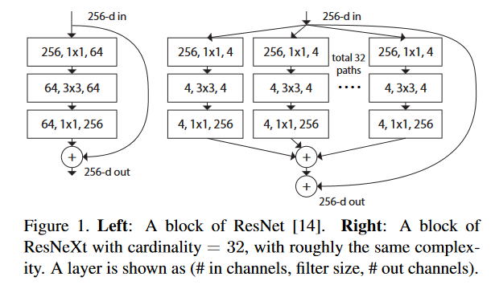
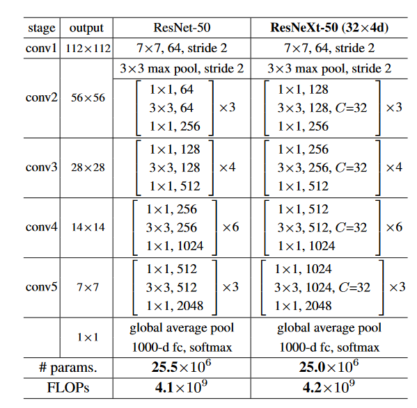

# ResNeXt

ResNeXt，简单来说是ResNet与Inception网络的优化，先简单复习一下ResNet与Inception网络。

## Inception

构建卷积层时，要决定过滤器的大小究竟是1×1，3×3还是5×5，或者要不要添加池化层。而**Inception**网络保留所有的过滤器和池化层输出，并把输出堆叠到一起。一个典型的**Inception**模块如下图。

一个具体的**Inception模组**例子：

一个**Inception网络**例子：

## 步入正题

ResNeXt，同时使用了ResNet与Inception网络的思想，让我们具体看看。

简单来说，ResNeXt使用了VGG/ResNets重复基本模块（repeating layers）的思想，也使用了Inception网络split-transform-merge的思想。

### 继承

**repeating layers**

VGG-nets与ResNets使用了一种构建深层网络的简单但是高效的策略：堆叠相同形状的基本模块。

**split-transform-merge**

什么叫做split-transform-merge的思想？

我们举一个最简单的例子：神经网络中的单个“神经”，示例图片如下：

这是一个最简单的“split-transform-merge”结构，可以拆分成3步：

1. Split：将数据 x 分割成 � 个子空间（特征）。
2. Transform：每个特征经过一个线性变换。即wi * xi。
3. Merge：通过单位加合成最后的输出。

### 超越

为什么说ResNeXt更好？主要两个原因：

1. 在与相同参数量的ResNet做比较时，ResNeXt性能更好。
2. Inception 需要人工设计每个分支，ResNeXt的分支的拓扑结构是相同的，更简单。

## ResNeXt

它与ResNet的最主要区别就是基本模块不同，两种基本模块对比如下。

完整网络模型对比如下：

可以看到ResNeXt与ResNet非常像。
