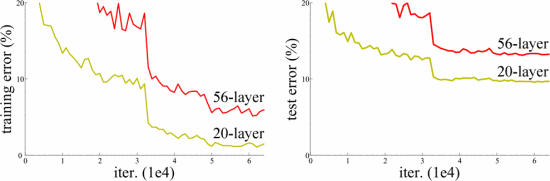
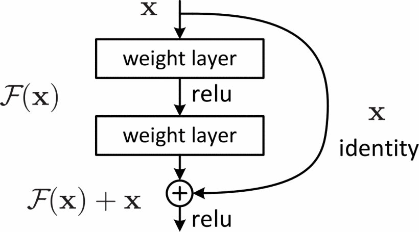
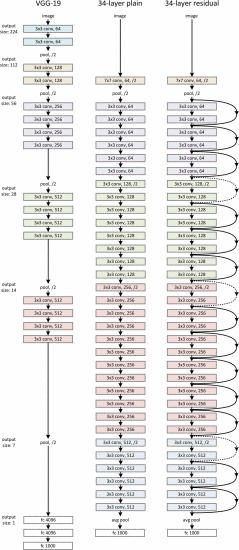
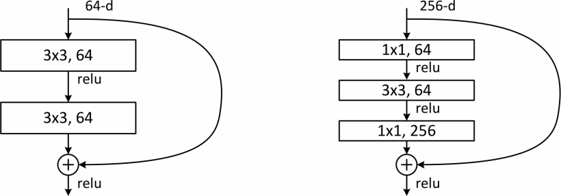

# 残差神经网络

非常非常深的神经网络是很难训练的，因为存在梯度消失和梯度爆炸问题。跳跃连接（**Skip connection**），它可以从某一层网络层获取激活，然后迅速反馈给另外一层，甚至是神经网络的更深层。利用跳跃连接构建能够训练深度网络的**残差网络（ResNet）**，有时深度能够超过100层。

把一个普通网络（**Plain network**）变成**ResNet**的方法是加上跳跃连接，如同下面这张图，每两层增加一个捷径，构成一个残差块，5个残差块连接在一起构成一个残差网络。

如果我们使用标准优化算法训练一个普通网络，比如说梯度下降法，没有加上残差，凭经验会发现随着网络深度的加深，训练错误会先减少，然后增多。（尽管理论上，随着网络深度的加深，应该训练得越来越好才对）

**ResNets**确实在训练深度网络方面非常有效，它确实有助于解决梯度消失和梯度爆炸问题，让我们在训练更深网络的同时，又能保证良好的性能。

## 论文

### 介绍

网络深度十分重要，然而主流的“深层”网络（只）包含16到30层。

如图，一个困境是对于朴素的神经网络，当深度到达一定程度时，更深的网络反而误差更大。原因来自于梯度消失与梯度爆炸。

**ResNet**希望对于一个更深的网络，其误差要比浅层版本要低。

这是一个基本模块，ResNet由这种基本模块堆叠构成。

在ImageNet数据集上实验后，ResNet的优点包括：

1. 容易优化，比朴素网络的误差更低。
2. 能够充分享受到深层网络的优势。

### 相关工作

之前的工作告诉我们，良好的重新制定或预处理可以简化优化过程。

相比“highway networks”，ResNet的基本模块是无参的，没有“门”的概念，门也不会关闭，并且能将层数做得更多。

### Deep Residual Learning

在朴素的网络中，我们假设某几层要学习H(x)。而上图中的ResNet基本模块中，添加了一条“捷径”，那些层本身要学习的变成了：F（x）= H（x）- x

这样，在通过捷径加入x后，又变回了原来的H（x）

这种操作有效的原因是，基本模块在什么也不做只是传递x时，即F(x)=0，就退化成了层数更少，更简单的网络，理论上误差不会比浅层网络更大。

相比与朴素的网络，ResNet训练H(x)=x更简单，因为只需要让F(x)的参数W=0。

如果用公式总结ResNet基本模块，（并且F与x维度一样）可以这么写：y = F(x, {Wi}) + x

在上图示例中使用了两层，所以F = W2 relu(W1x)

如果F与x维度不一致，公式可以修改为：y = F(x, {Wi}) + Wsx

作者建议只在使用维度匹配时加入参数W2，因为实验证明不加参数W2性能已经足够。

如上图，分别是VGG-19，朴素网络与残差网络。注意虽然看上去VGG-19更简单，残差网络的参数量是更少的。

残差网络的设计有两个特点：

1. 同一个基本模块的过滤器数量相同。
2. 特征矩阵每次减半，过滤器数量翻倍。

### Experiments

对于ImageNet数据集的实验证明RetNet很棒，三个原因：

1. 对于RetNet更深的网络，其误差要比浅层版本要低。
2. 在深层学习中残差学习很高效。
3. 更快收敛。

为了训练经济考虑（在有限的计算资源下缩短训练时间），论文作者引入了瓶颈层。如下图右侧，两个1x1的卷积层负责降维和升维，所以留给3x3卷积层计算的数据可以变少。

注意引入瓶颈层会使准确率下降（原因与朴素网络相同），引入的理由只是训练经济考虑。
