# 基于知识蒸馏的视频问答模型

## 研究现状

​	视频问答任务的研究经过不断发展，其主要的求解方法可以大致抽象为一个简单的视频问答框架，其主要包括了视频特征的提取、问题特征的提取、多模态的融合以及最后的答案生成。

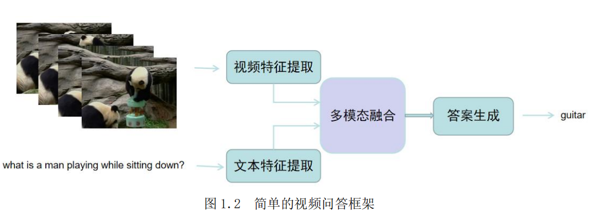

## 研究内容

​	视频问答任务，就是通过给机器输入一段视频 *V* 以及针对该视频的一个问题 *q*，需要机器可以在分析视频内容和理解问题内容后，正确地推断出答案。**由于现有的数据集在求解上，一般都是通过从一个候选答案集合中选择出最有可能的答案，作为预测答案a*。**那么我们可以将这视为一个分类任务，即机器需要对答案集合 *A* 求解概率分布，将概率最高的答案作为预测答案。所以，预测答案 *a* *可以表示为：

​	其中，*P* 代表预测概率，*θ*代表模型的参数。我们希望机器在通过训练后，其预测的答案可以接近于正确答案。

​	本文主要研究内容包括了以下几个方面：

​	（1） 通过注意力机制加强特定区域特征关注。首先通过自注意力机制对问题特征中各个单词的注意力进行强化，以降低问题中一些不重要的单词的关注程度。同时，通过以问题为导向，计算视觉特征中各个片段上的注意力权重，以将机器的关注点放在与问题更加相关的视频片段中。并且在视频外观独有特征与关联特征融合和视频的各个片段特征融合时，同样使用了自注意力的机制来提升特征的融合效果。

​	（2） 通过图卷积网络进行视频节点间的关系推理。本文采用了多头图卷积的方式，并将每个图卷积头得到的特征进行连接，作为卷积结果。为了更充分的使用图卷积挖掘与推理视频节点关系，采用了多层图卷积的方式，并在图卷积过程中融入注意力的机制，以加强对视频各个节点之间关系的学习。同时，在该步骤中不仅推理了视频的外观特征和动作特征，还使用了损失函数约束的方式挖掘了在外观中与动作视觉信息相关联的特征与在动作中与外观视觉信息相关联的特征，进一步地提取了外观和动作之间潜在关联关系。

​	（3） 通过知识蒸馏进一步优化模型。本文在训练教师模型的基础上，构造并训练了一个相对轻量的学生模型来改善模型性能。而其在减少模型可训练参数，对模型进行轻量化的同时，还达到了加强多个模态之间的特征融合的效果。通过添加损失函数的方式，将教师模型中多模态融合后的知识蒸馏出来，用于学生模型中单模态的学习。这样学生模型在单模态训练过程中便可以得到丰富的多模态的信息，在训练初期更早地进行多模态之间的交互，以改善之后的多模态的融合效果。

## 模型

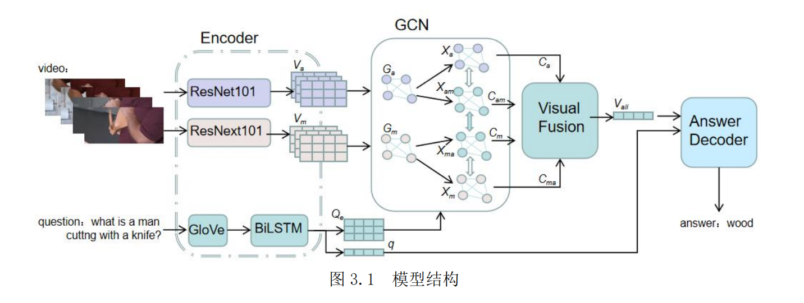

​	在本方法中，分别训练了可训练参数较多的教师模型，以及在教师模型指导下的体量相对较小的学生模型。

​	其首先包括了**视觉特征和文本特征的编码模块**，通过预训练模型提取视频特征，得到外观特征和动作特征，同时使用预训练词向量表编码问题中的单词，之后通过 BiLSTM 处理来更好地提取了视频帧和问题单词的上下文信息。
​	接着是**视觉-文本交互模块**，该模块主要采用了注意力的机制以及多头图卷积的方式，分别对视觉与文本信息进行了交互，减少了无关信息对模型的干扰，同时对视频各片段间关系进行推理。
​	然后是**视觉特征融合模块**，该模块同样采用了注意力的机制对独有和关联特征融合及外观和动作特征进行融合，以及对各个片段的视觉特征进行了融合，得到了融合的视觉特征。
​	最后是**答案生成模块**，其通过融合视觉特征以及文本语义特征，通过解码器实现了对最终答案的分类。

### 编码模块

#### 视觉编码

​	在视觉编码模块中，本方法使用特征向量来对视频进行表示，这里分别提取了视频的外观特征和动作特征。由于视频的长短及每张图像的大小不一致，需要对视频特征的维度进行规范化，同时在回答视频对应的问题时，可以得出答案的视频内容可能不是整段视频，而是通过视频中几帧的片段便可以得出答案。所以本方法将一个视频进行均匀地切分，每个视频表示为 *c* 个连续的片段，每个片段包含了 *f* 帧的图像，图图像的像素大小固定为 *h*×*w*。最终所得到的视觉特征表示为 *V*∈R *c*×*f*×*h*×*w*×*channel*。其中 *c* 表示片段数量，*f* 表示每个片段的帧数，*h* 表示图像像素的高度，*w* 表示图像像素的宽度，*channel* 表示图像像素的信道数。

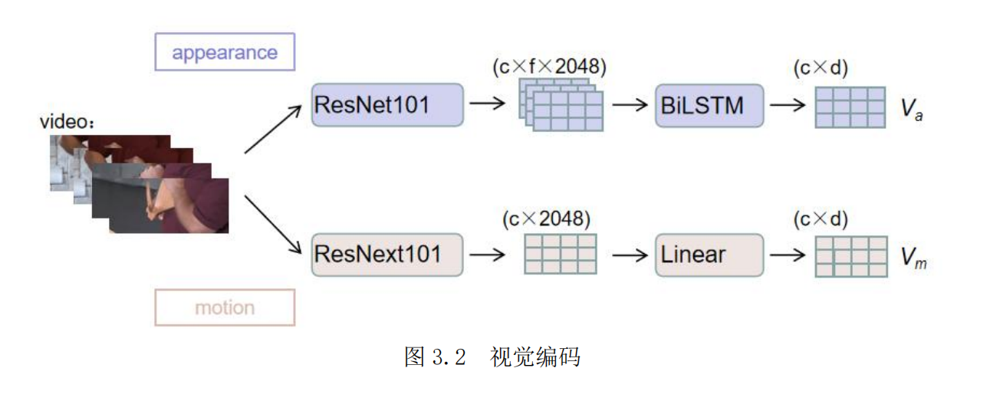

1. 对于外观特征本方法使用了预训练模型 ResNet-101 来提取，将该模型最后的全连接层除去后，通过该模型将每一帧图像表示为 2048 维的特征向量。接着，为了获取视频每个片段综合各帧的语义特征，使用了 BiLSTM 对每一个片段进行处理，得到了视频每个片段的语义特征表示。最终所得到的静态的外观特征表示为 *V**a* ∈*R* *c*×*f*×*d*，其中 *c* 表示每个视频的片段数，*f* 表示每个片段的帧数，*d* 表示模型维度。
2. 对于动作特征，使用了预训练模型 ResNeXt-101 来提取，同样将该模型最后的全连接层除去后，使用该模型将每一个片段用 2048 维特征向量进行表示。接着使用了一层线性层对特征进行处理，以将特征维度映射为模型维度大小。最终所得到的动态的动作特征表示为 *V**m*∈*R* *c*×*d*，其中 *c* 表示每个视频的片段数，*d* 表示模型维度大小。

#### 文本编码

​	首先将训练集中所有问题出现的高频单词整理为词汇表，通过词汇表对单词进行唯一编码，以此每个句子可以表示为**一串单词索引序列**，便得到了对句子的编码表示，即*Q*∈R *l*，其中 *l* 表示问题的长度。

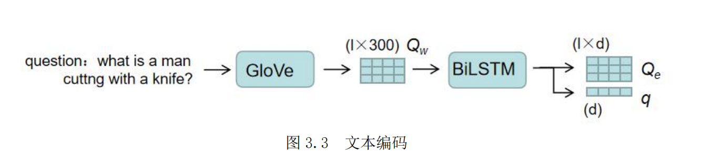

​	为了更好地得到问题句子中的单词特征表示，本方法使用了预训练的 GloVe 词向量表对问题中的**每一个单词**进行编码表示，如图 3.3 所示。将每一个单词表示为 300 维特征向量，便得到了问题的单词特征，即 *Q**w*∈R *l*×300，其中 *l* 表示问题的最大长度，300表示 GloVe 嵌入特征的维度。同时，为了进一步提取单词的上下文特征以及整个句子的语义特征，**分别使用了两个 BiLSTM 来提取句子的嵌入特征和语义特征。每个句子的嵌入特征表示为 Q e*∈R* l*×*d，语义特征表示为 *q*∈R *l*，**其中 *l* 表示问题的最大长度，*d* 表示模型维度大小。

### 视觉-文本交互模块

#### 文本注意力

当对一个问题进行理解并做出回答时，其中某些单词的作用可能只是用来规范语法，而对于推理答案来说不那么重要。所以为了更好地突出文本的单词编码中某些单词的重要程度，而适当忽略某些不重要的单词，模型通过注意力的机制对特征进行了优化。

通过对嵌入特征 *Qe*计算各个单词的注意力得分以作为权重，对单词特征 *Qw* 进行加权求和，以得到问题的整体表示，如图所示。具体来说，首先将 *Q**e*通过了一层线性层进行处理并使用 L2 归一化后，再通过一层线性层映射为得分。接着使用 Softmax 激活函数进行归一化处理，便得到了各个单词的注意力得分*α*。之后将*α*与单词编码特征进行加权求和，便得到了整个句子的注意力特征 *Qatt*，公式表示为：

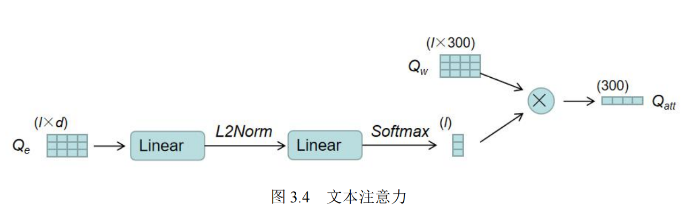

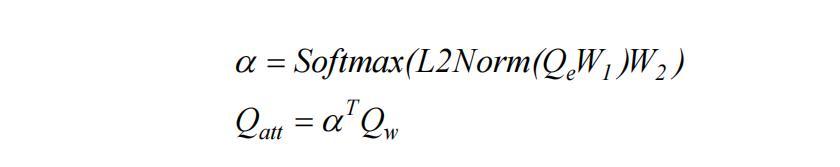

其中，*W*1和 *W*2为可学习参数，*W*1∈R*d*×*d*，*W*2∈R*d*×1，得到的注意力特征 *Q**att*∈R 300。

#### 问题导向的视觉注意力

一段视频由多个片段构成，而在回答某个问题时，可能该问题只与视频的某几个片段相关。模型只需要重点理解这几个片段就可以对问题做出回答，而不需要将所有的片段进行考虑。所以在这里将以问题为导向的注意力作用在视频的各个片段上，以获得视频各个片段的注意力得分，来重点关注某些片段而适当忽略某些片段。

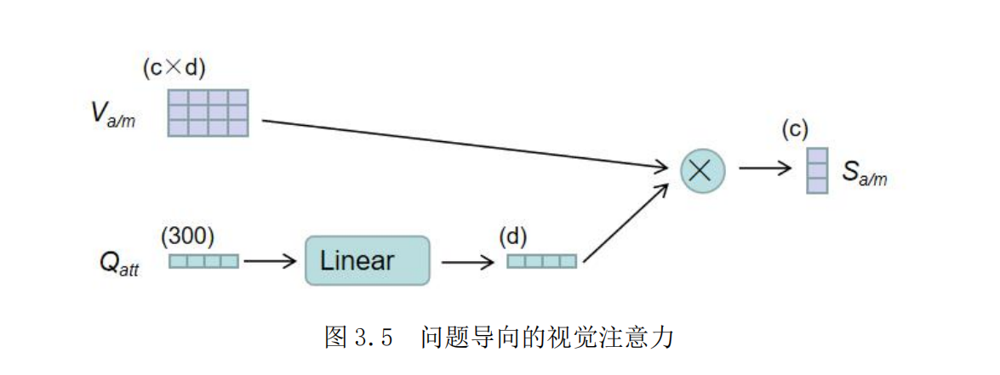

该模块对于视频的外观特征和动作特征处理的步骤相同，接下通过 *a/m* 对外观特征和动作特征进行统一表示，处理步骤如图 3.5 所示。首先将上一步得出的整个问题的注意特征通过一层线性层映射到模型维度，使其特征维度与视频相同，接着将其与视觉特征进行矩阵点积运算后，经过 Sigmoid 函数激活便得到了视觉特征各个片段的得分 *S**a/m*，外观和动作特征处理的统一的公式表示为：

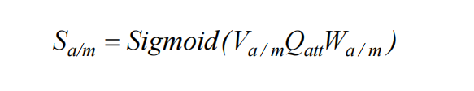

其中，*W**a/m*分别表示外观特征和动作特征的可训练参数。这里可以得到以问题为导向的视频各个片段注意力得分，为 *S**a/m*∈R *c*。

### 前置总结

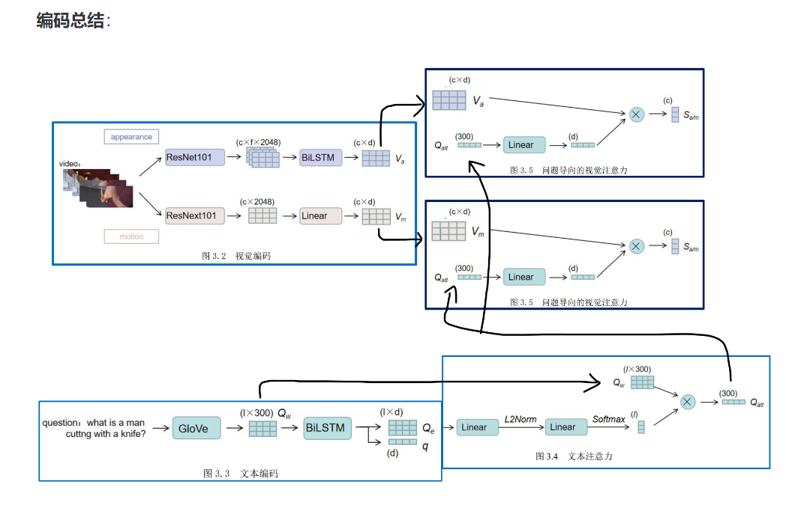

### 视频特征融合

#### 图卷积

借鉴了DualVGR 的思想，对图卷积网络进行建模，其结构如图所示。

先看一层GCN如何计算：在每一层的 GCN 中，其通过了 k 个图卷积头进行处理，每个头的计算方式一样，最后将各个头的结果进行**拼接**。

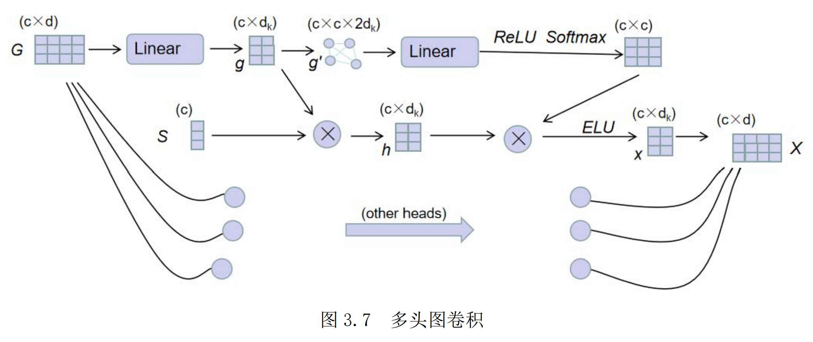

一个头的计算过程：

1. 输入特征G来自上一层GCN的输出X，如果是第一层，则来自视觉特征V
2. 将输入特征G通过一层线性层映射后将其作为该图卷积头所要处理的视觉特征g
3. 接着通过将g与视觉注意分数S 进行相乘，达到对重要片段重点关注的目的，得到了注意力下的视觉特征 h
4. 将各个片段作为节点，将两个片段之间的特征值拼接后组为边，把 g 构造成为了一个无向全连接的图 g’
5. 接着使用注意力的机制，通过图特征g’得到了每两个节点之间关系的权重大小 
6. 将β与视觉特征 h 相乘，以通过各个片段之间的关系权重大小来得到每个片段基于全部片段的关系所得到的特征，通过 ELU 激活函数得到x
7. 将各个头的结果进行拼接得到本层输出X

这样一层GCN迭代多层，拿到最后一层的输出X，作为特征C。

最终，可以得到了通过图卷积推理关系特征，而提取的外观的独有特征 *C**a*和关联特征 *C**am*，以及动作的独有特征 *C**m*和关联特征 *C**ma*。

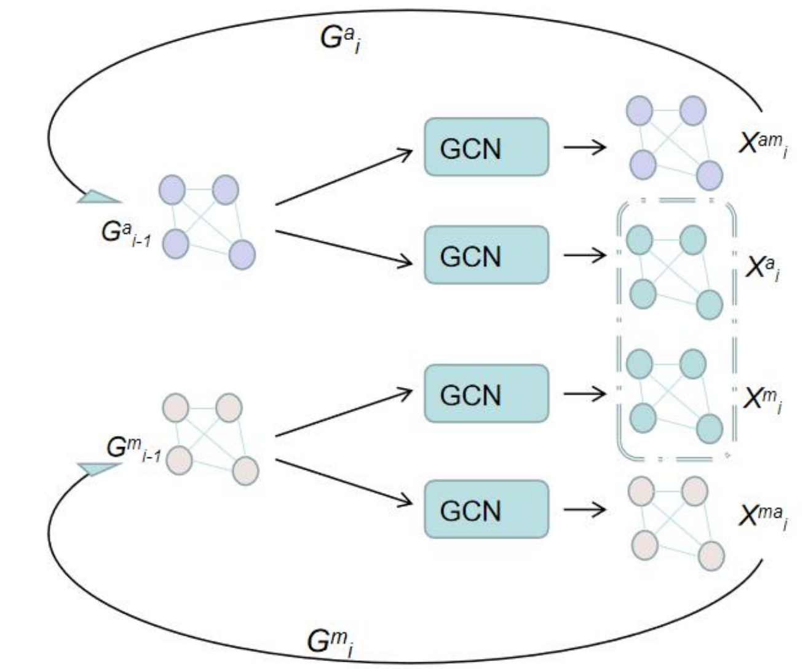

#### 前置总结

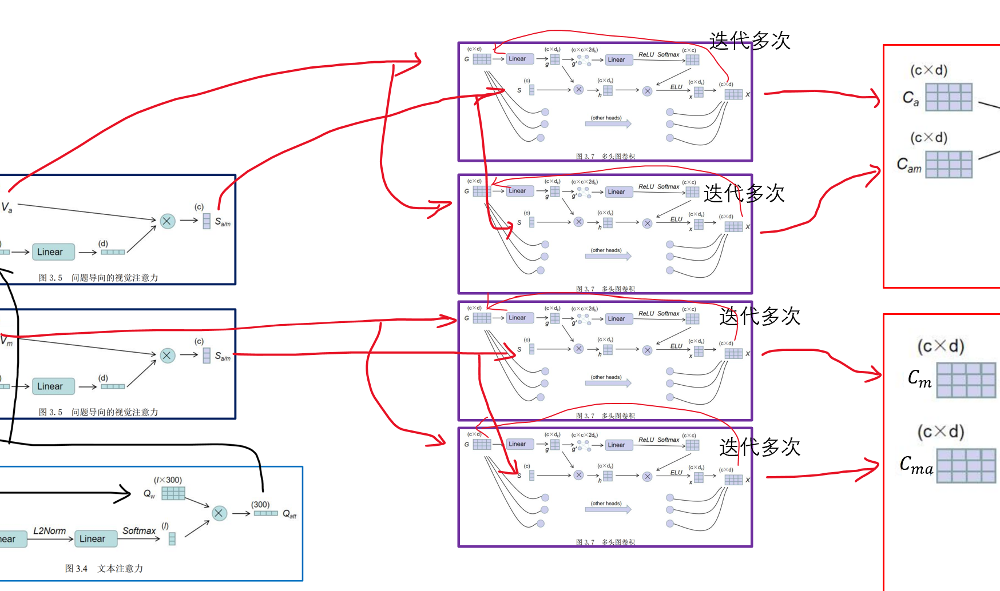

#### 视觉融合模块

##### 独有-关联特征融合

为了更好地突出视觉特征中独有特征和关联特征各自的重要性，类似地，本方法采取了注意力的机制来进行独有-关联特征融合。

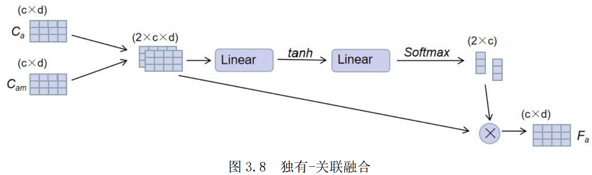

首先将外观的独有特征 *Ca*和联合动作 *Cam*拼接后为[*Ca*, *Cam*]，通过一层线性层以及tanh 激活函数后，再通过一层线性层将其映射为对于两类特征的注意力分数。接着通过Softmax 激活函数进行归一化处理后，将其作为权重对两类特征进行加权求和，便得到了融合的外观特征 *Fa*

同理，将动作的独有特征和联合特征进行融合，可以得到了融合的动作特征 *Fm*模型得到了表征视频各个片段之间的关系信息的特征 *Fa*和 *Fm*。所以为了得到综合的包含关系信息的视觉特征，同时防止训练时反向传播过程中梯度消失的问题，本方法采用了残差连接的策略。将基于关系推理过程的结果特征与最初提取的视觉特征进行相加，得到了最终的融合了关系信息的视觉特征 *Va/m*

​                                                                                             Va / m* =*Va / m* + *Fa / m*

##### 外观-动作融合

该模块将视觉外观特征和视觉动作特征进行了融合，本方法采取了多模态因子双线性池化（Multimodal Factorized Bilinear pooling，MFB）的方法，得到了视频每个片段地融合视觉特征

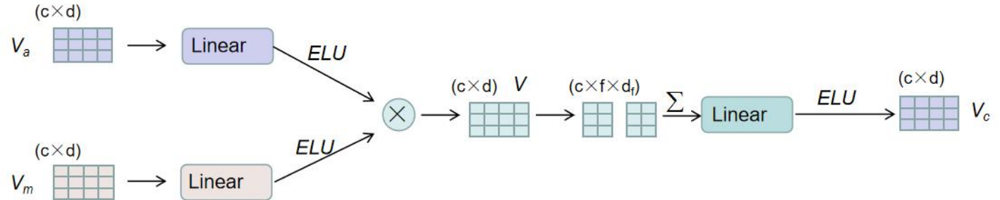

##### 片段融合

该模块将视频中的每一个片段特征进行了融合，本方法借鉴了图读出操作（GraphReadout Operation）中的方法，通过自注意力的机制得到整个视频的融合特征表示，其过程如图所示。

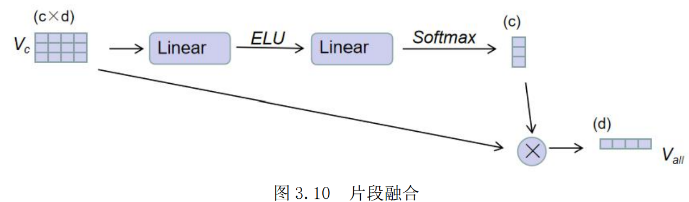

##### 前置总结

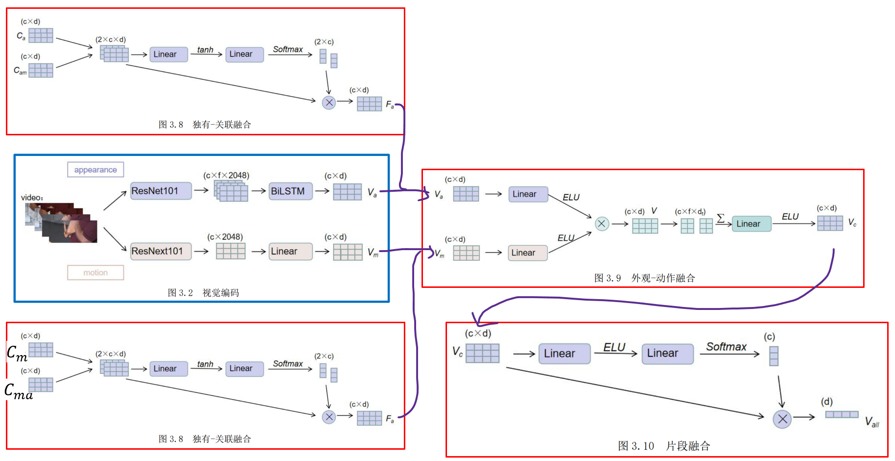

### 答案生成模块

至此，模型得到了与文本交互后的融合视觉特征，该特征便是在机器在该问题下所理解的视频信息，现在只需要要通过该视频信息回答问题。这里本方法通过融合视觉特征和问题语义特征，解码最终用于生成答案的特征。

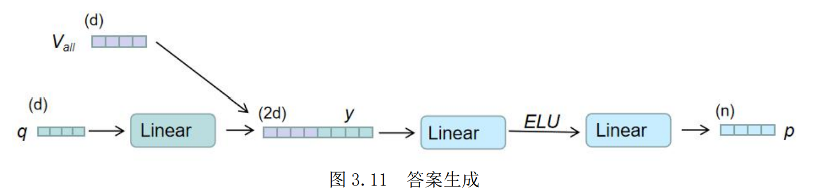

将语义特征 *q* 通过一层线性层后，与视觉特征 *V**all*进行拼接，得到融合特*y*。接着使用分类器对融合特征进行处理，其先经过了一层线性层映射为模型维度后，使用 ELU 激活函数处理，再经过一层线性层将特征维度映射为答案分类数目，得到了最终用于生成答案的特征 *p*，n为答案分类的数目

## 总结

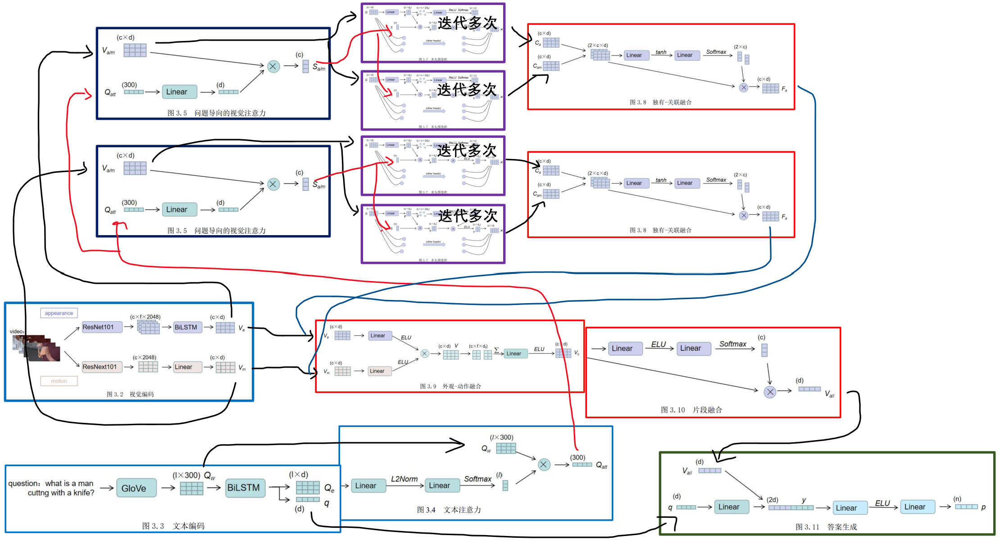

## 多模态知识蒸馏架构

将教师模型中多模态融合后的知识蒸馏出来，用于学生模态中单模态的学习，使得学生模型可以在单模态训练过程中得到教师模型丰富的多模态知识，在训练初期更早地进行多模态之间的交互与融合，以改善之后多模态融合的效果。

在教师模型中，模型使用了多层的图卷积对视觉特征进行了迭代计算，这是因为模型只有在迭代进行多次的图卷积计算后，才可以更好地实现视频关系的多步推理，提取关系特征。而在学生模型的构造上，只使用了单层的图卷积来处理视觉特征，以轻量化模型的体量，压缩模型。

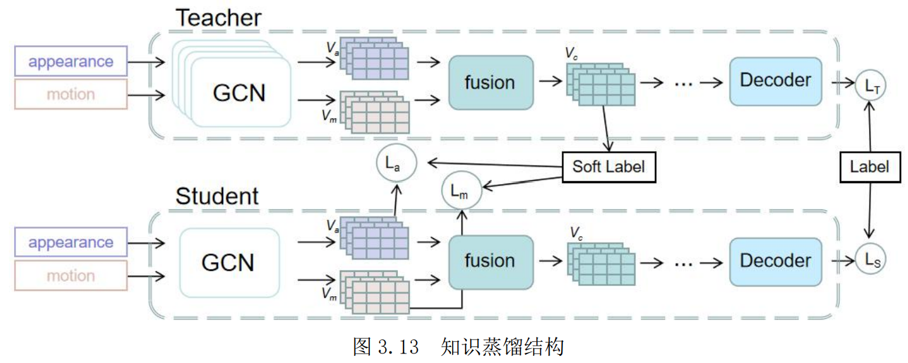

首先本方法完整训练一个教师模型，并通过实验进行参数调节，得到了训练得较好的教师模型。接着在学生模型训练时，将教师模型中外观视觉特征与动作视觉特征融合后的融合视觉特征，分别用于学生模型的外观和动作的视觉特征的学习。

